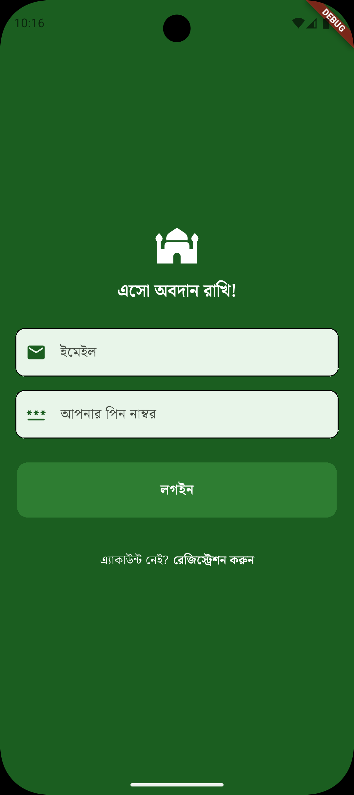

# Islamic App – Flutter

A modern Islamic Foundation mobile application built with **Flutter** for Android, designed to help users access Islamic resources including daily Hadiths, prayer events, Quranic content, and more. This app uses **Riverpod** for state management and communicates with a **REST API** backend for dynamic content. Users can edit their profile, make donation and
keep track of their donation. Events, Donations campains will let the user know what he can do for the community. Read the quran, see the hadith and most importantly donate to the needy!
A heartfull thanks to **Mazharul Islam** for helping developing the backend. Barak Allahu Feekum.

---

## Table of Contents

- [Features](#features)
- [Screenshots](#screenshots)
- [Tech Stack](#tech-stack)
- [Installation](#installation)
- [Usage](#usage)
- [Project Structure](#project-structure)
- [API Integration](#api-integration)
- [Contributing](#contributing)
- [License](#license)

---

## Features

- User **registration and login** with secure token-based authentication.
- Display **daily Hadiths** with auto-fetch from API.
- View **Islamic events** with details including title, date, location, and description.
- Quran content (Surahs and details) with multi-language support.
- Admin can see list of all users (can ban and promote/demote their role).
- Admin can see the full donation history.
- Admin can add/delete events, FAQ's, new donation campaigns. 
- **Responsive design** for different screen sizes.
- **Riverpod** state management for efficient and reactive UI updates.
- Local secure storage for auth token using `flutter_secure_storage`.
- **SQFLite** for Quran Cache.

---

## Screenshots

<p float="left">
   
   
  
   
   
   
   
   
   
   
</p>

---

## Tech Stack

- **Frontend:** Flutter, Dart
- **State Management:** Riverpod
- **Networking:** HTTP package
- **Local Storage:** flutter_secure_storage
- **Backend:** REST API (Laravel)
- **Database:** SQLite (for caching Quran)

---

## Installation

### Prerequisites

- Flutter SDK installed on your machine: [Flutter Installation Guide](https://docs.flutter.dev/get-started/install)
- Android Studio / VS Code with Flutter plugin
- Basic knowledge of Flutter widgets and Dart

### Steps

1. **Clone the repository**

```bash
git clone https://github.com/Fardeenhimself/esho_obodan_rakhi.git
cd islamic_app
```

2. **Install dependencies**

```bash
flutter pub get
```

3. **Run the app on emulator or physical device**

```bash
flutter run
```

---

## Usage

1. **Register a new account** or **login** if you already have one.
2. **Home screen** displays a random Hadith. Refresh to get a new one.
3. Navigate to **Events** to see a list of upcoming Islamic events. Tap an event to see full details.
4. Explore **Quranic content** or other modules in the app.
5. See islamic events or donation campain
6. Donate to the needy and **Keep Track**

---

## Project Structure

```
lib/
├─ components/        # Reusable UI widgets (Cards, Buttons, TextFields)
├─ models/            # Data models (Hadith, Event, Product)
├─ providers/         # Riverpod state providers
├─ repositories/      # API logic and data fetching
├─ screens/           # UI screens (Home, Register, Login, EventDetail)
├─ services/          # Local storage, API helpers
├─ main.dart          # App entry point
```

---

## API Integration

- The app communicates with a **REST API backend**.
- Auth token is stored securely and sent in the `Authorization` header for protected endpoints.
- Example endpoints:

| Module | Endpoint                 | Method | Description             |
| ------ | ------------------------ | ------ | ----------------------- |
| Auth   | `/api/login`             | POST   | User login              |
| Auth   | `/api/signup`            | POST   | User registration       |
| Hadith | `/api/hadith/single`     | GET    | Get random Hadith       |
| Event  | `/api/event/list`        | GET    | List all events         |
| Event  | `/api/event/single/{id}` | GET    | Get event details by ID |

---


## For Mor Info

Contact Me: fardeen.cse20@gmail.com
